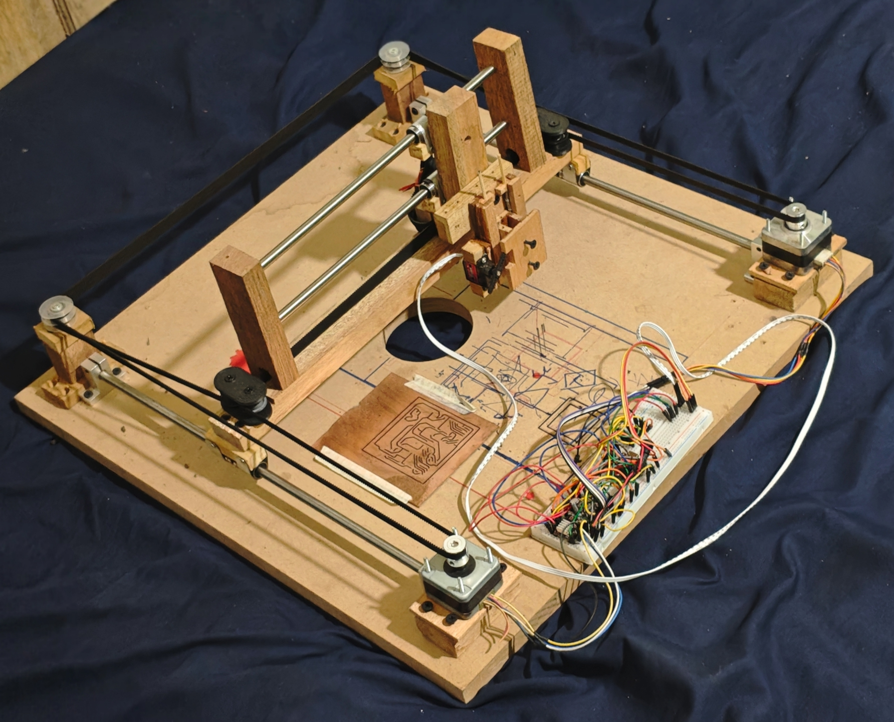

# Cici

Open-source CoreXY pen plotter.

## Bill of Materials

Estimated price in **IDR** (Shopee)

| Qty | Part | Unit | Total |
|-----|------|-----:|------:|
| 1 | 12 V 2 A power adapter | Rp 20.000 | Rp 20.000 |
| 2 | 8 mm linear shaft, 40 cm | Rp 20.000 | Rp 40.000 |
| 2 | 8 mm linear shaft, 30 cm | Rp 15.000 | Rp 30.000 |
| 8 | LM8UU linear bearing | Rp 7.000 | Rp 56.000 |
| 4 | SK8 shaft mount (8 mm) | Rp 7.500 | Rp 30.000 |
| 8 | 625-2RS bearing | Rp 3.750 | Rp 30.000 |
| 4 m | GT2 timing belt, 6 mm wide | Rp 15.000/m | Rp 60.000 |
| 2 | NEMA 17 stepper motor (SECOND/USED) | Rp 25.000 | Rp 50.000 |
| 1 | MG90S servo | Rp 20.000 | Rp 20.000 |
| 2 | DRV8825 stepper driver | Rp 20.000 | Rp 40.000 |
| 1 | ESP32-C3 SuperMini | Rp 35.000 | Rp 35.000 |
| 2 | GT2 pulley 20T, 6 mm belt, 5 mm bore | Rp 12.000 | Rp 24.000 |
| 2 | 220 µF 35 V capacitor | Rp 2.500 | Rp 5.000 |
| 1 | DC 2.1×5.5 mm female jack | Rp 1.000 | Rp 1.000 |
| 1 | Small Spring (extracted from clicky pen) | Rp 4.000 | Rp 4.000 |
| — | Misc. A (jumpers, breadboard, ribbon cables, screws, nuts) | — | Rp 30.000 |
| — | Misc. B (50x50cm MDF base, woods) | — | Rp 20.000 |
| | **Total (estimated)** | | **Rp 495.000** |

---

